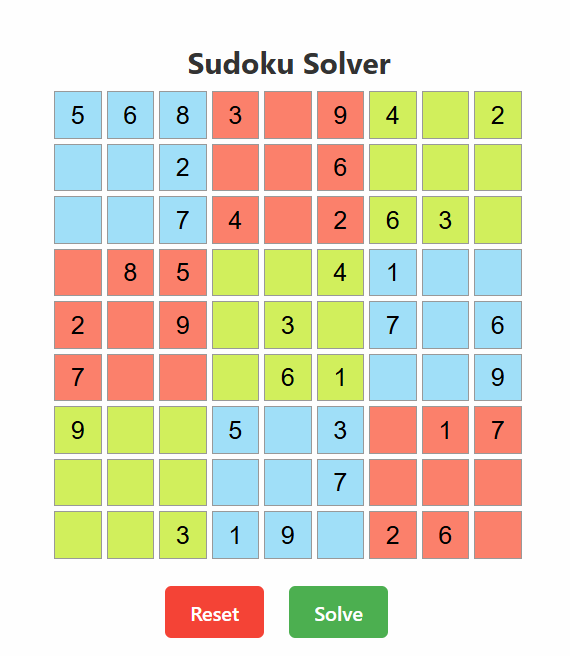

# 🧠 Sudoku Solver Web App

A full-stack Sudoku Solver built with **React.js** frontend and **Flask** backend. Users can input puzzles, solve them with a click, and get visual feedback via confetti and toast notifications when the solution is found.

<p align="center">
  
  
  <br/>
  <em>Example of a solved puzzle in the UI</em>
</p>

---

## 🛠️ Tech Stack

- **Frontend:** React.js, Vite, React Toastify
- **Backend:** Flask (Python)
- **OCR/ML:** Custom Python Sudoku solver logic
- **UI Behavior:** Interactive board with visual cell groups and keyboard validation

---

## 🚀 Running the App

### 🧱 React Build (only when new changes are amended to ui)

```bash
cd ui
npm install
npm run build
```

### 🐍 Run Flask Server

```bash
cd main
python app.py
```


