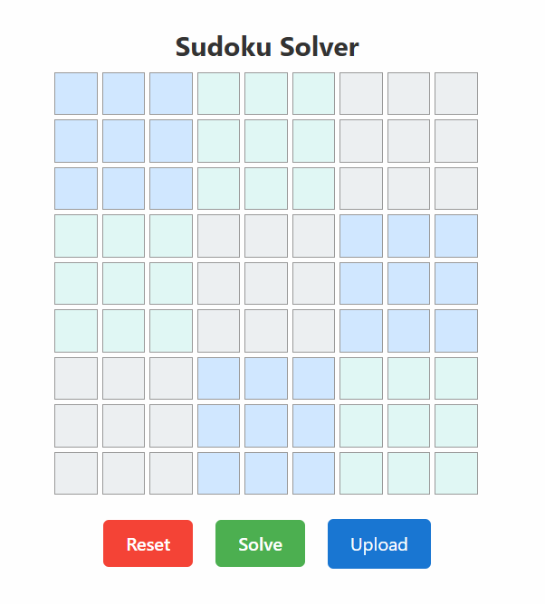
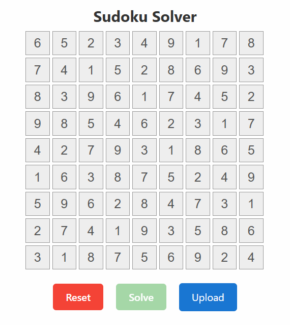

# Sudoku Solver App 🧠🧩

A React + Flask-based Sudoku Solver app that allows you to:

- Manually input/upload Sudoku puzzles
- Automatically solve them using backtracking
- **Upload an image of a Sudoku puzzle** (screenshot, snip, etc.)
  - The app extracts the digits using OCR (Tesseract) and pre-fills the board

---

## 🛠 Technologies Used

- **Frontend**: React.js
- **Backend**: Python Flask
- **Digit Recognition (OCR)**: Tesseract via pytesseract
- **Image Processing**: OpenCV

---

## 🚀 Features

- Clean Sudoku grid UI with block color differentiation
- Solve puzzle instantly with a single click
- Reset puzzle to empty state
- Upload Sudoku puzzle images to auto-detect numbers
- Fireworks confetti on correct solve 🎉

---

## 📷 Upload Sudoku from Image

You can now upload any screenshot or image of a Sudoku puzzle. The app will:

1. Extract the largest square region (Sudoku grid)
2. Warp it into a perfect square
3. Slice into 81 cells
4. OCR each cell using Tesseract
5. Automatically populate the React grid with the digits detected

Supported: Printed puzzles (e.g. snipped from websites, PDFs, etc.)

---

## 🧪 Running the App

### Backend (Flask)
```bash
cd main
python app.py
```

Make sure you have Tesseract installed and available in your PATH.

On Windows, add this line before running:
```python
pytesseract.pytesseract.tesseract_cmd = r'C:\Program Files\Tesseract-OCR\tesseract.exe'
```

### Frontend (React)
```bash
cd ui
npm install
npm start
```
---

#  🧠 Workflow

<em>Examples of a solved puzzle in the UI</em>
<p align="center">
  <br/>
  <br/>
  <br/>
  
  <br/>
  
</p>

---
